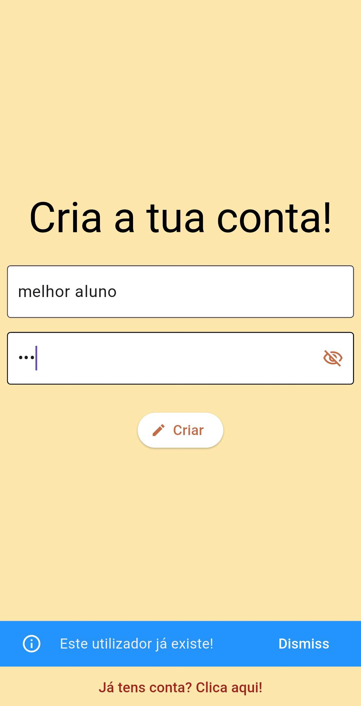
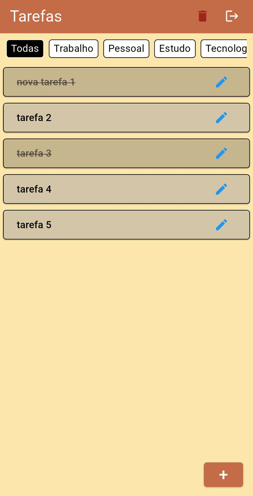
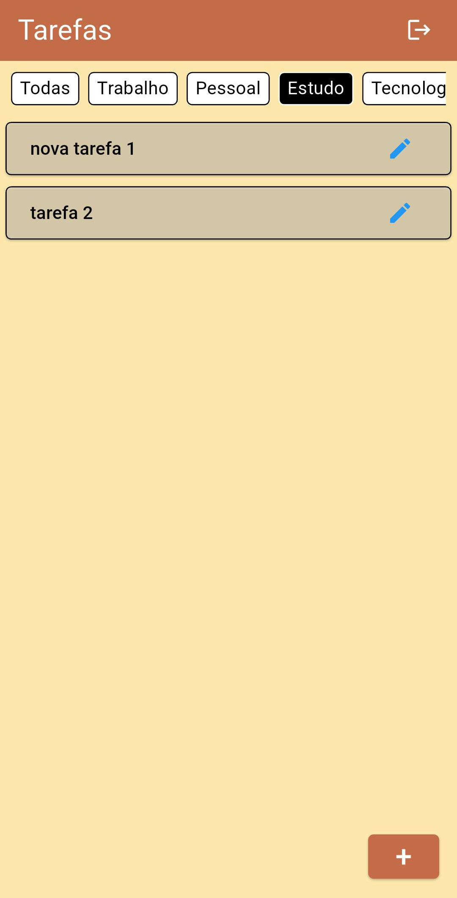
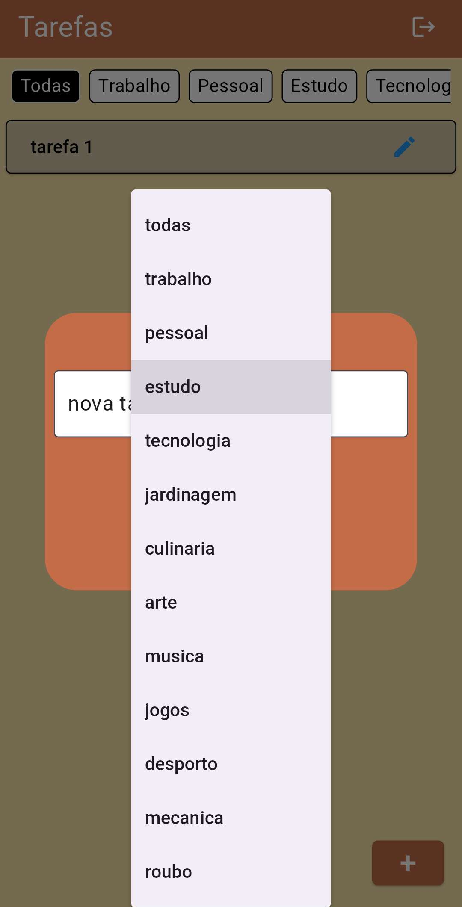
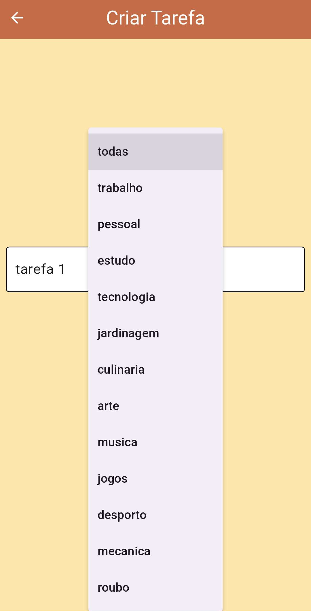

<div align="center">
  <h1>Notizen</h1>
  
</div>

<p>
    <b>English</b> |
    <a href="https://github.com/anotherlusitano/Notizen-App/blob/main/README.md">Português</a>
</p>

## Description

Notizen is an Android task management application, created as the final project for the Mobile Computing course.

## Features
| **Feature**               | **Description**                                                                 |
|---------------------------|-------------------------------------------------------------------------------|
| 🔐 Authentication         | Register and log in using an SQLite database                                  |
| 📥 Create Tasks          | Add tasks with a category                                                      |
| ✏️ Edit Tasks            | Modify the content of existing tasks                                          |
| 🗑️ Delete Tasks         | Remove completed tasks                                                         |
| ✅ Complete Tasks        | Mark tasks as completed with a single tap                                     |
| 📑 Categorization        | Access all tasks within a specific category                                   |
| 🔒 Isolated Tasks        | Each user has their own private tasks                                         |

## UI
<details>
  <summary>Login Page</summary>
  
  
</details>
<details>
  <summary>Sign-Up Page</summary>
  
  
</details>
<details>
  <summary>Home Page</summary>
  
  
</details>
<details>
  <summary>Edit Task Page</summary>
  
  
</details>
<details>
  <summary>Create Task Page</summary>
  
  
</details>

## Installation

The easiest way to install this application is by [installing the APK](https://github.com/anotherlusitano/Notizen-App/releases/download/v1.0.0/notizen.apk).

Alternatively, you can build the APK by following these steps:

1. **Clone the repository**  
   In the terminal, run the following command:
   ```sh
   git clone https://github.com/anotherlusitano/Notizen-App.git
   ```  

2. **Build the APK**
   Then, navigate into the project folder and build the APK:
   ```sh
   cd Notizen-App/
   flutter build apk --release
   ```
   The APK will be located in `build/app/outputs/flutter-apk/app-release.apk`

3. **Install the APK on your device**  
   Finally, with the Android device connected via USB, simply run the following command:
   ```sh
   flutter install apk
   ```  
