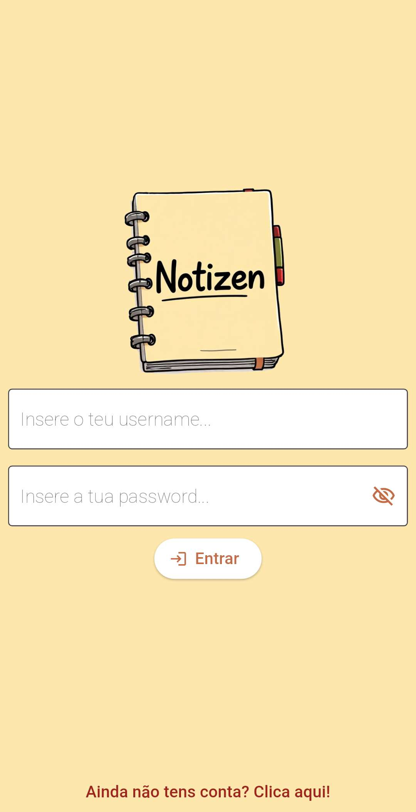
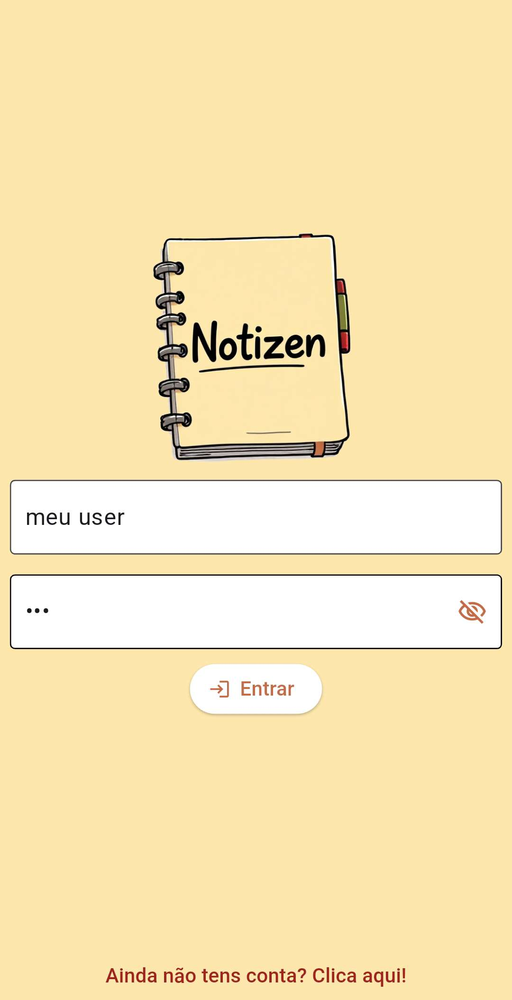
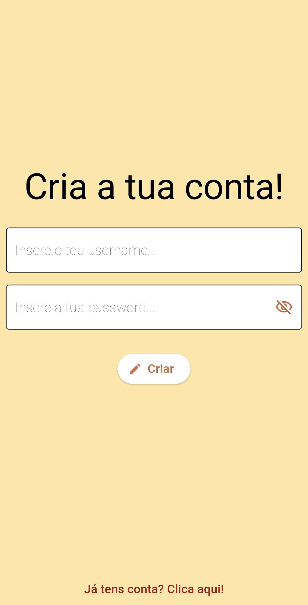
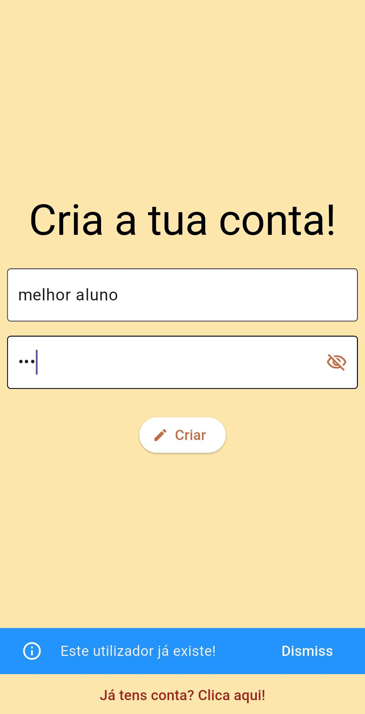
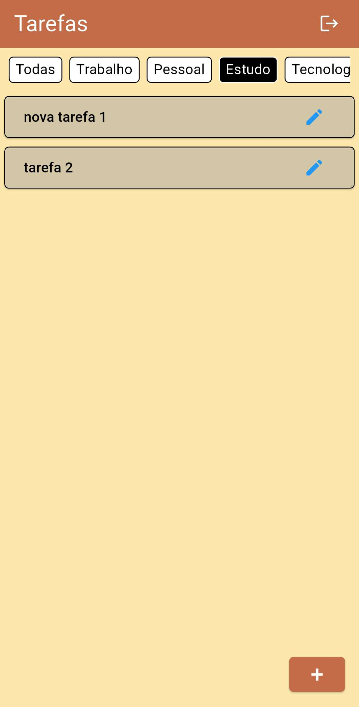
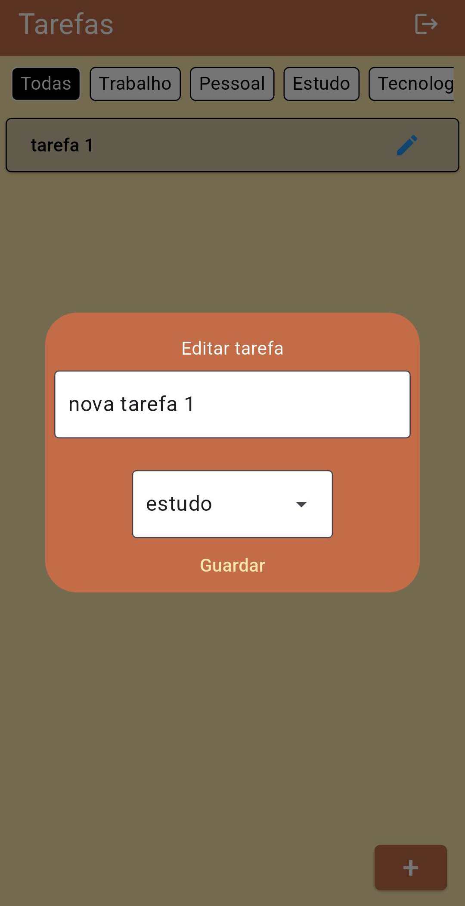
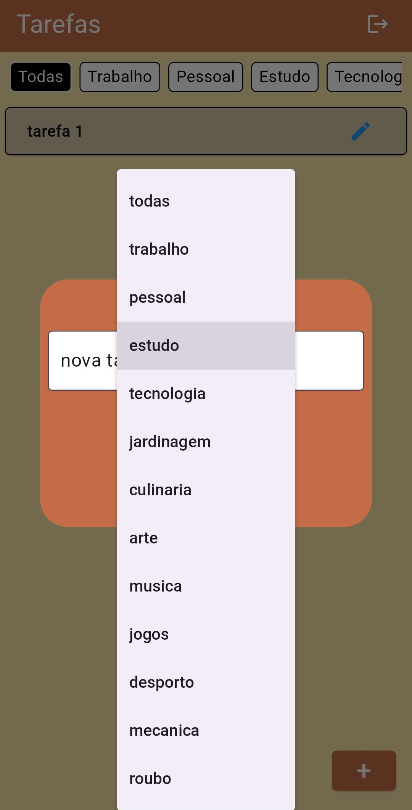
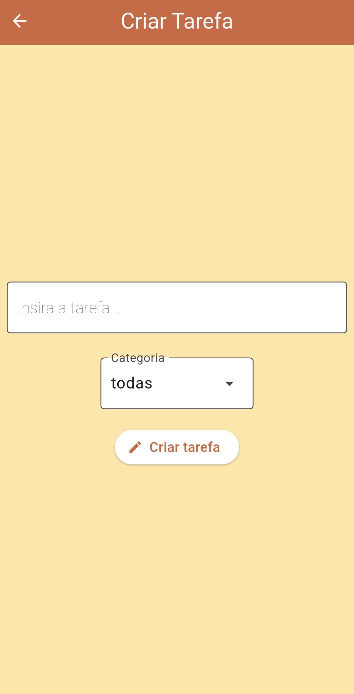
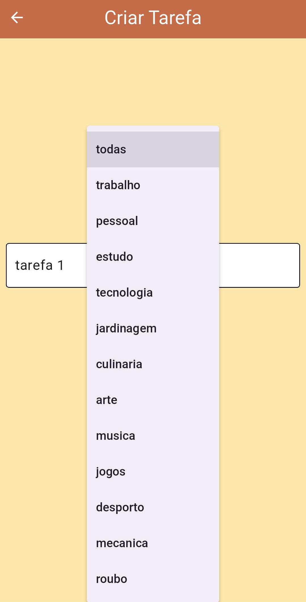

<div align="center">
  <h1>Notizen</h1>
  
</div>

<p>
    <b>Português</b> |
    <a href="https://github.com/anotherlusitano/Notizen-App/blob/main/README-en.md">English</a>
</p>

## Descrição

O Notizen é uma aplicação Android para gestão de tarefas, criada como trabalho final da disciplina de Computação Móvel.

## Funcionalidades
| **Funcionalidade**               | **Descrição**                                                                 |
|---------------------------|-------------------------------------------------------------------------------|
| 🔐 Autenticação           | Registo e login com uma base de dados SQLite                                            |
| 📥 Criar Tarefas          | Adicione tarefas com uma categoria                                    |
| ✏️ Edição de Tarefas        | Modifique o conteúdo das tarefas existentes                                      |
| 🗑️ Eliminação de Tarefas        | Elimine tarefas concluidas                                 |
| ✅ Concluir Tarefas       | Marque tarefas como concluídas com um toque                                   |
| 📑 Divisão por Categorias              | Acesse todas as tarefas de uma determinada categoria                                           |
| 🔒 Tarefas Isoladas | Cada utilizador tem as suas próprias tarefas                           |

## UI
<details>
  <summary>Página de Login</summary>
  
  
</details>
<details>
  <summary>Página de Sign Up</summary>
  
  
</details>
<details>
  <summary>Página Home</summary>
  
  
</details>
<details>
  <summary>Página de Editar Tarefa</summary>
  
  
</details>
<details>
  <summary>Página de Criar Tarefa</summary>
  
  
</details>

## Instalação

A forma mais fácil de instalar esta aplicação é através da [instalação do apk](https://github.com/anotherlusitano/Notizen-App/releases/download/v1.0.0/notizen.apk).

Alternativamente, podes compilar o APK seguindo os seguintes passos:

1. **Clone do repositório**  
   No terminal, executa o seguinte comando:  
   ```sh
   git clone https://github.com/anotherlusitano/Notizen-App.git
   ```  

2. **Compilação do APK**  
   Depois basta ir para dentro da pasta do projeto e compilar o apk:
   ```sh
   cd Notizen-App/
   flutter build apk --release
   ```
   O apk vai encontrar-se em `build/app/outputs/flutter-apk/app-release.apk`

3. **Instalar o APK no dispositivo**  
   Por fim, com o dispositivo Android conectado via USB, basta executar o seguinte comando:
   ```sh
   flutter install apk
   ```
